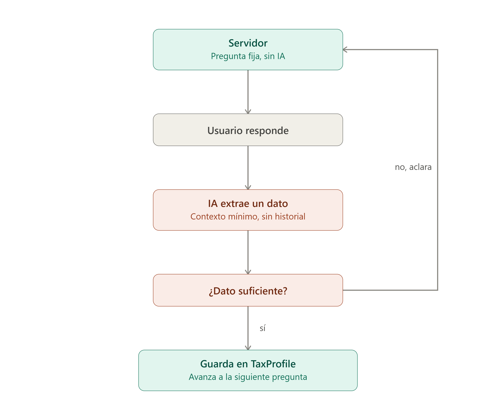

# Asistente Tributario — Declaración de Renta Colombia

Chatbot que guía a una persona natural, paso a paso, para determinar si debe declarar renta en Colombia, con base en los topes vigentes de la DIAN — y genera un reporte final con el resultado y una estimación aproximada del impuesto a pagar.

> **Aviso:** esta herramienta genera una recomendación orientativa, no un documento legal. Se recomienda revisar tu situación tributaria con un contador antes de declarar.

## Características



- Conversación guiada (no chat libre) que recolecta ingresos, patrimonio, consumos con tarjeta, compras, consignaciones y responsabilidad de IVA
- Motor de reglas determinista que evalúa los 5 topes DIAN + responsabilidad de IVA (Fase 3)
- Estimación aproximada del impuesto aplicando la tabla progresiva del Artículo 241 del Estatuto Tributario (Fase 9)
- Panel de administrador para actualizar los topes de UVT y fechas de declaración cada año, sin tocar código
- Autenticación con JWT, contraseñas con política de complejidad
- IA 100% local vía Ollama — sin costo de API, sin enviar datos tributarios a servicios externos
- Modo oscuro/claro, sidebar de conversaciones y reportes, sistema de notificaciones

## Arquitectura

El diseño separa deliberadamente dos responsabilidades que nunca se mezclan:

- **La IA (Ollama + llama3.1:8b)** solo interpreta lenguaje natural y extrae datos — nunca calcula si alguien debe declarar ni cuánto debe pagar.
- **El motor de reglas** (código determinista, sin IA) hace todos los cálculos tributarios, con tests unitarios que verifican los resultados contra ejemplos oficiales.

El chatbot usa un **flujo guiado paso a paso** (no conversación libre): el servidor controla qué pregunta se hace en cada momento, y cada llamada a la IA está acotada a extraer un único dato con el mínimo contexto necesario. Este diseño reemplazó una primera versión conversacional libre que resultó poco confiable con un modelo local pequeño — ver la sección de obstáculos más abajo.

Usuario ⇄ Chat UI (React) ⇄ Backend API (Express)<br>
├─ Ollama (llama3.1:8b) → extrae un dato por turno<br>
├─ Motor de reglas → evalúa obligación (determinista)<br>
├─ Motor de impuesto → tabla progresiva Art. 241 ET
(determinista)<br>
└─ PostgreSQL → usuarios, perfiles, reglas fiscales, reportes

## Stack tecnológico

| Capa            | Tecnología                                  |
| --------------- | ------------------------------------------- |
| Backend         | Node.js, Express, Prisma 6                  |
| Base de datos   | PostgreSQL                                  |
| IA / chatbot    | Ollama (llama3.1:8b), tool calling          |
| Frontend        | React (Vite), React Router                  |
| Autenticación   | JWT, bcrypt                                 |
| Infraestructura | Docker Compose                              |
| Testing         | node:test (nativo), sin frameworks externos |

## Estructura del repositorio

chatbot-declaracion-renta/ <br>
├── server/<br>
│ ├── prisma/ # schema, migraciones, seed<br>
│ ├── src/<br>
│ │ ├── controllers/<br>
│ │ ├── services/ # motor de reglas, motor de impuesto, flujo del chat<br>
│ │ ├── middlewares/<br>
│ │ ├── routes/<br>
│ │ └── utils/<br>
│ └── scripts/ # createAdmin, resetTestUser, testExtraction, testE2E<br>
├── client/<br>
│ └── src/<br>
│ ├── pages/<br>
│ ├── components/<br>
│ ├── auth/<br>
│ └── theme/<br>
└── docker-compose.yml

## Requisitos previos

- Docker Desktop
- Git
- [GitHub CLI](https://cli.github.com/) (opcional, solo si vas a contribuir)
- ~8 GB de RAM libres recomendados (para correr `llama3.1:8b` en CPU)

## Instalación y ejecución

### 1. Clonar el repositorio

```bash
git clone https://github.com/ADEP-123/chatbot-declaracion-renta.git
cd chatbot-declaracion-renta
```

### 2. Configurar variables de entorno

```bash
cp server/.env.example server/.env
cp client/.env.example client/.env
```

Genera un `JWT_SECRET` real y pégalo en `server/.env`:

```bash
node -e "console.log(require('crypto').randomBytes(48).toString('hex'))"
```

> **¿De dónde sale el `DATABASE_URL`?** No hay que crear ninguna cuenta ni copiar nada de un panel externo — el valor ya viene resuelto en `server/.env.example` porque coincide con las credenciales que este mismo `docker-compose.yml` define para el contenedor de PostgreSQL:
>
> ```yaml
> db:
>   image: postgres:16-alpine
>   environment:
>     POSTGRES_USER: taxbot
>     POSTGRES_PASSWORD: taxbot_dev
>     POSTGRES_DB: taxbot_db
> ```
>
> Esas tres variables arman la cadena `postgresql://<usuario>:<contraseña>@<host>:<puerto>/<base_de_datos>` — en este caso `postgresql://taxbot:taxbot_dev@db:5432/taxbot_db`. El host es `db` (no `localhost`) porque así se llama el servicio dentro de la red interna de Docker Compose; el backend lo resuelve automáticamente.
>
> Si en algún momento quieres apuntar a una base de datos distinta (por ejemplo, Postgres en la nube), solo tienes que reemplazar `DATABASE_URL` en `server/.env` por la cadena de conexión que te dé ese proveedor — el resto de la app no necesita ningún cambio.

### 3. Levantar los contenedores

```bash
docker compose up -d --build
```

Esto levanta PostgreSQL, el backend, el frontend y Ollama.

### 4. Descargar el modelo de lenguaje

```bash
docker compose exec ollama ollama pull llama3.1:8b
```

### 5. Migrar y sembrar la base de datos

```bash
docker compose exec server npx prisma migrate dev
docker compose exec server npx prisma db seed
```

### 6. Crear un usuario administrador

```bash
docker compose exec server npm run create:admin -- admin@correo.com Admin123! "Admin"
```

### 7. Abrir la aplicación

- App: http://localhost:5173
- API: http://localhost:4000/api/health
- Prisma Studio (opcional, para ver la base de datos): `docker compose exec server npx prisma studio` → http://localhost:5555

## Variables de entorno

| Variable          | Dónde  | Descripción                                                                  |
| ----------------- | ------ | ---------------------------------------------------------------------------- |
| `DATABASE_URL`    | server | Cadena de conexión a PostgreSQL                                              |
| `JWT_SECRET`      | server | Secreto para firmar tokens — mínimo 32 caracteres, nunca el valor de ejemplo |
| `CLIENT_ORIGIN`   | server | Origen permitido por CORS                                                    |
| `OLLAMA_BASE_URL` | server | URL del servicio de Ollama                                                   |
| `OLLAMA_MODEL`    | server | Modelo a usar (`llama3.1:8b` recomendado — ver benchmark abajo)              |
| `VITE_API_URL`    | client | URL del backend que consume el frontend                                      |

## Pruebas

El proyecto usa tres niveles de confianza distintos, porque no todo lo que prueba es igual de determinista:

```bash
docker compose exec server npm test              # Unitarios: motor de reglas, reportes, impuesto — deben pasar siempre
docker compose exec server npm run test:extraction  # Extracción de IA por paso — casi siempre deben pasar
docker compose exec server npm run test:e2e      # Flujo completo contra Ollama real — prueba de humo, no garantía absoluta
```

## Decisiones de diseño y obstáculos encontrados

- **Prisma 7 → Prisma 6**: Prisma lanzó su v7 justo antes de empezar el proyecto, con cambios de arquitectura (config de datasource, generación de cliente) que rompían con cada actualización menor, incluyendo una v8 en release candidate apenas tres meses después. Se optó por la v6 estable, la misma que usa la mayoría de la documentación y tutoriales actuales.
- **Sin presupuesto para la API de Claude → Ollama local**: el chatbot corre sobre un modelo open-source (`llama3.1:8b`) vía Ollama, sin costo de API y sin enviar datos tributarios sensibles a un servicio externo — con la contrapartida de menor calidad de conversación que un modelo de frontera.
- **Conversación libre → flujo guiado**: la primera versión del chatbot dejaba conversar libremente y usaba a la IA para decidir qué preguntar y cuándo extraer datos. Con un modelo de 8B esto generó inconsistencias recurrentes (confusión entre campos parecidos, mala interpretación de periodicidad, "olvidos" de extracción con contexto acumulado). Se rediseñó como un flujo de preguntas fijas controladas por el servidor, donde la IA solo extrae un dato por turno con el contexto mínimo indispensable — esto redujo drásticamente los errores.
- **Selección de modelo basada en datos, no en intuición**: se comparó `llama3.2` (3B) contra `llama3.1:8b` con una batería de casos de prueba reproducible (`test:extraction`), obteniendo 2/4 contra 4/4 aciertos respectivamente — la decisión de usar el modelo más pesado (y más lento) se tomó con evidencia, no por preferencia.
- **Atajos deterministas para casos triviales**: respuestas como negaciones simples ("no he usado tarjeta") o síes/noes aislados se detectan con expresiones regulares antes de siquiera llamar al modelo, más rápido, gratis, y 100% confiable para esos casos.
- **Motor de reglas e impuesto sin IA**: tanto la decisión de "debe declarar" como el cálculo de tarifa progresiva son funciones puras y testeadas contra ejemplos oficiales — la IA nunca hace aritmética tributaria.

## Limitaciones conocidas

- La estimación del impuesto aplica la tabla progresiva directamente sobre los ingresos brutos, sin restar deducciones ni rentas exentas, por diseño, sobreestima el valor real a pagar.
- El modelo local ocasionalmente requiere una vuelta de aclaración adicional en algún paso; no hay garantía de cero fricción en el 100% de las conversaciones.
- Sin despliegue en la nube por ahora, el alcance de la Fase 8 se limitó a endurecimiento de seguridad local (rate limiting, CORS, cabeceras, validación de secretos).

## Autor

Andrés David Elizalde Peralta — [github.com/ADEP-123](https://github.com/ADEP-123)
